## Importing requirement


```python
import pandas as pd
import numpy as np
import tensorflow as tf
import os
from tqdm import tqdm
from glob import glob
import gc
import cv2
import matplotlib.pyplot as plt
from sklearn.utils import shuffle
import math
import zipfile
```

## Loading dataset


```python
train_csv = pd.read_csv('./data/train.csv')
test_csv = pd.read_csv('./data/test.csv')
```


```python
train_csv.head()
```


<div>
<style scoped>
    .dataframe tbody tr th:only-of-type {
        vertical-align: middle;
    }

    .dataframe tbody tr th {
        vertical-align: top;
    }

    .dataframe thead th {
        text-align: right;
    }
</style>
<table border="1" class="dataframe">
  <thead>
    <tr style="text-align: right;">
      <th></th>
      <th>img_id</th>
      <th>input_img</th>
      <th>label_img</th>
    </tr>
  </thead>
  <tbody>
    <tr>
      <th>0</th>
      <td>10000</td>
      <td>train_input_10000.png</td>
      <td>train_label_10000.png</td>
    </tr>
    <tr>
      <th>1</th>
      <td>10001</td>
      <td>train_input_10001.png</td>
      <td>train_label_10001.png</td>
    </tr>
    <tr>
      <th>2</th>
      <td>10002</td>
      <td>train_input_10002.png</td>
      <td>train_label_10002.png</td>
    </tr>
    <tr>
      <th>3</th>
      <td>10003</td>
      <td>train_input_10003.png</td>
      <td>train_label_10003.png</td>
    </tr>
    <tr>
      <th>4</th>
      <td>10004</td>
      <td>train_input_10004.png</td>
      <td>train_label_10004.png</td>
    </tr>
  </tbody>
</table>
</div>


```python
test_csv.head()
```


<div>
<style scoped>
    .dataframe tbody tr th:only-of-type {
        vertical-align: middle;
    }

    .dataframe tbody tr th {
        vertical-align: top;
    }

    .dataframe thead th {
        text-align: right;
    }
</style>
<table border="1" class="dataframe">
  <thead>
    <tr style="text-align: right;">
      <th></th>
      <th>img_id</th>
      <th>input_img</th>
      <th>submission_name</th>
    </tr>
  </thead>
  <tbody>
    <tr>
      <th>0</th>
      <td>20000</td>
      <td>test_input_20000.png</td>
      <td>test_20000.png</td>
    </tr>
    <tr>
      <th>1</th>
      <td>20001</td>
      <td>test_input_20001.png</td>
      <td>test_20001.png</td>
    </tr>
    <tr>
      <th>2</th>
      <td>20002</td>
      <td>test_input_20002.png</td>
      <td>test_20002.png</td>
    </tr>
    <tr>
      <th>3</th>
      <td>20003</td>
      <td>test_input_20003.png</td>
      <td>test_20003.png</td>
    </tr>
    <tr>
      <th>4</th>
      <td>20004</td>
      <td>test_input_20004.png</td>
      <td>test_20004.png</td>
    </tr>
  </tbody>
</table>
</div>


```python
train_all_input_files = './data/train_input_img/'+train_csv['input_img']
train_all_label_files = './data/train_label_img/'+train_csv['label_img']
```


```python
len(train_all_input_files), len(train_all_label_files)
```


    (622, 622)


```python
train_all_input_files[0], train_all_label_files[0]
```


    ('./data/train_input_img/train_input_10000.png',
     './data/train_label_img/train_label_10000.png')


```python
train_input_files = train_all_input_files[60:].to_numpy()
train_label_files = train_all_label_files[60:].to_numpy()

val_input_files = train_all_input_files[:60].to_numpy()
val_label_files = train_all_label_files[:60].to_numpy()
```


```python
for input_path, label_path in zip(train_input_files, train_label_files):
    inp_img = cv2.imread(input_path)
    targ_img = cv2.imread(label_path)
    plt.figure(figsize=(15,10))
    inp_img = cv2.cvtColor(inp_img, cv2.COLOR_BGR2RGB)
    targ_img = cv2.cvtColor(targ_img, cv2.COLOR_BGR2RGB)
    plt.subplot(1,2,1)
    plt.imshow(inp_img)
    plt.subplot(1,2,2)
    plt.imshow(targ_img)
    plt.show()
    print(input_path, label_path, '\n')
    break
```


    
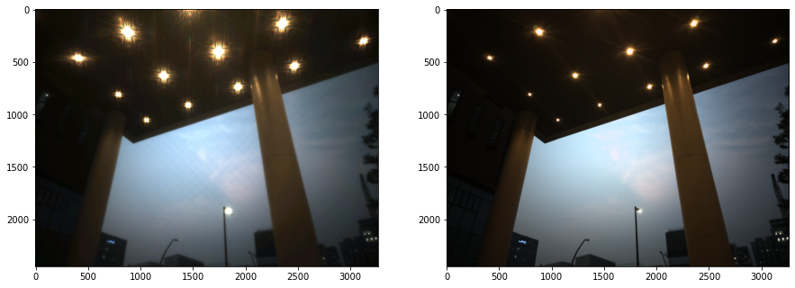
    


    ./data/train_input_img/train_input_10060.png ./data/train_label_img/train_label_10060.png 
    
    

## Hyperparameter setting for pre-trained Residual network for ImageNet.


```python
BATCH_SIZE = 8
img_size = 256
#weights = None
weights = 'imagenet'
learning_rate = 1e-5
EPOCHS = 5
dropout_rate = 0.1
```

## Preprocessing

Crop the original image into 256x256


```python
def cut_img(img_path_list, save_path, stride):
    os.makedirs(f'{save_path}{img_size}', exist_ok=True)
    num = 0
    for path in tqdm(img_path_list):
        img = cv2.imread(path)
        for top in range(0, img.shape[0], stride):
            for left in range(0, img.shape[1], stride):
                piece = np.zeros([img_size, img_size, 3], np.uint8)
                temp = img[top:top+img_size, left:left+img_size, :]
                piece[:temp.shape[0], :temp.shape[1], :] = temp
                np.save(f'{save_path}{img_size}/{num}.npy', piece)
                num+=1
```


```python
cut_img(train_input_files, './data/train_input_img_', 128)
cut_img(train_label_files, './data/train_label_img_', 128)
cut_img(val_input_files, './data/val_input_img_', 128)
cut_img(val_label_files, './data/val_label_img_', 128)
```

    100%|██████████| 562/562 [01:19<00:00,  7.04it/s]
    100%|██████████| 562/562 [01:18<00:00,  7.15it/s]
    100%|██████████| 60/60 [00:15<00:00,  3.83it/s]
    100%|██████████| 60/60 [00:15<00:00,  3.83it/s]
    


```python
train_inp_files = glob(f'./data/train_input_img_{img_size}/*.npy')
train_targ_files = glob(f'./data/train_label_img_{img_size}/*.npy')

val_inp_files = glob(f'./data/val_input_img_{img_size}/*.npy')
val_targ_files = glob(f'./data/val_label_img_{img_size}/*.npy')
```


```python
train_inp_files, train_targ_files = shuffle(train_inp_files, train_targ_files, random_state=42)
```


```python
len(train_inp_files), len(val_inp_files), len(train_targ_files), len(val_targ_files), 
```


    (155740, 31200, 155740, 31200)


## Data preparation and augmentation

We normalized the 3 channel input image from 0-255 into 0-1 

augmentation type : rotate, flip


```python
def train_map_func(inp_path, targ_path):
    inp = np.load(inp_path)
    inp = inp.astype(np.float32)/255
    targ = np.load(targ_path)
    targ = targ.astype(np.float32)/255
    inp, targ = augmentation(inp, targ)
    
    return inp, targ

def val_map_func(inp_path, targ_path):
    inp = np.load(inp_path)
    inp = inp.astype(np.float32)/255
    targ = np.load(targ_path)
    targ = targ.astype(np.float32)/255
    return inp, targ

def augmentation(inp, targ):
    inp, targ = random_rot(inp, targ)
    inp, targ = random_flip(inp, targ)
    
    return inp, targ

def random_rot(inp, targ):
    k = np.random.randint(4)
    inp = np.rot90(inp, k)
    targ = np.rot90(targ, k)
    
    return inp, targ

def random_flip(inp, targ):
    f = np.random.randint(2)
    if f == 0:
        inp = np.fliplr(inp)
        targ = np.fliplr(targ)
        
    return inp, targ
```


```python
train_dataset = tf.data.Dataset.from_tensor_slices((train_inp_files, train_targ_files))
train_dataset = train_dataset.map(lambda item1, item2: tf.numpy_function(train_map_func, [item1, item2], [tf.float32, tf.float32]), num_parallel_calls=tf.data.experimental.AUTOTUNE)
train_dataset = train_dataset.batch(BATCH_SIZE)
train_dataset = train_dataset.prefetch(buffer_size=tf.data.experimental.AUTOTUNE)

val_dataset = tf.data.Dataset.from_tensor_slices((val_inp_files, val_targ_files))
val_dataset = val_dataset.map(lambda item1, item2: tf.numpy_function(val_map_func, [item1, item2], [tf.float32, tf.float32]), num_parallel_calls=tf.data.experimental.AUTOTUNE)
val_dataset = val_dataset.batch(BATCH_SIZE)
val_dataset = val_dataset.prefetch(buffer_size=tf.data.experimental.AUTOTUNE)
```


```python
next(iter(train_dataset))[0].shape, next(iter(train_dataset))[1].shape, next(iter(val_dataset))[0].shape, next(iter(val_dataset))[1].shape
```


    (TensorShape([8, 256, 256, 3]),
     TensorShape([8, 256, 256, 3]),
     TensorShape([8, 256, 256, 3]),
     TensorShape([8, 256, 256, 3]))


## Functional model definition

We employed U-Net with ResNet101V2


```python
def convolution_block(x, filters, size, strides=(1,1), padding='same', activation=True):
    x = tf.keras.layers.Conv2D(filters, size, strides=strides, padding=padding)(x)
    x = tf.keras.layers.BatchNormalization()(x)
    if activation == True:
        x = tf.keras.layers.LeakyReLU(alpha=0.1)(x)
    return x

def residual_block(blockInput, num_filters=16):
    x = tf.keras.layers.LeakyReLU(alpha=0.1)(blockInput)
    x = tf.keras.layers.BatchNormalization()(x)
    blockInput = tf.keras.layers.BatchNormalization()(blockInput)
    x = convolution_block(x, num_filters, (3,3) )
    x = convolution_block(x, num_filters, (3,3), activation=False)
    x = tf.keras.layers.Add()([x, blockInput])
    return x
```


```python
def ResUNet101V2(input_shape=(None, None, 3), dropout_rate=0.1, start_neurons = 16):
    backbone = tf.keras.applications.ResNet101V2(weights=weights, include_top=False, input_shape=input_shape)
    input_layer = backbone.input
    
    conv4 = backbone.layers[122].output
    conv4 = tf.keras.layers.LeakyReLU(alpha=0.1)(conv4)
    pool4 = tf.keras.layers.MaxPooling2D((2, 2))(conv4)
    pool4 = tf.keras.layers.Dropout(dropout_rate)(pool4)
    
    convm = tf.keras.layers.Conv2D(start_neurons * 32, (3, 3), activation=None, padding="same")(pool4)
    convm = residual_block(convm,start_neurons * 32)
    convm = residual_block(convm,start_neurons * 32)
    convm = tf.keras.layers.LeakyReLU(alpha=0.1)(convm)
    
    deconv4 = tf.keras.layers.Conv2DTranspose(start_neurons * 16, (3, 3), strides=(2, 2), padding="same")(convm)
    uconv4 = tf.keras.layers.concatenate([deconv4, conv4])
    uconv4 = tf.keras.layers.Dropout(dropout_rate)(uconv4)
    
    uconv4 = tf.keras.layers.Conv2D(start_neurons * 16, (3, 3), activation=None, padding="same")(uconv4)
    uconv4 = residual_block(uconv4,start_neurons * 16)
    uconv4 = residual_block(uconv4,start_neurons * 16)
    uconv4 = tf.keras.layers.LeakyReLU(alpha=0.1)(uconv4)
    
    deconv3 = tf.keras.layers.Conv2DTranspose(start_neurons * 8, (3, 3), strides=(2, 2), padding="same")(uconv4)
    conv3 = backbone.layers[76].output
    uconv3 = tf.keras.layers.concatenate([deconv3, conv3])    
    uconv3 = tf.keras.layers.Dropout(dropout_rate)(uconv3)
    
    uconv3 = tf.keras.layers.Conv2D(start_neurons * 8, (3, 3), activation=None, padding="same")(uconv3)
    uconv3 = residual_block(uconv3,start_neurons * 8)
    uconv3 = residual_block(uconv3,start_neurons * 8)
    uconv3 = tf.keras.layers.LeakyReLU(alpha=0.1)(uconv3)

    deconv2 = tf.keras.layers.Conv2DTranspose(start_neurons * 4, (3, 3), strides=(2, 2), padding="same")(uconv3)
    conv2 = backbone.layers[30].output
    uconv2 = tf.keras.layers.concatenate([deconv2, conv2])
        
    uconv2 = tf.keras.layers.Dropout(0.1)(uconv2)
    uconv2 = tf.keras.layers.Conv2D(start_neurons * 4, (3, 3), activation=None, padding="same")(uconv2)
    uconv2 = residual_block(uconv2,start_neurons * 4)
    uconv2 = residual_block(uconv2,start_neurons * 4)
    uconv2 = tf.keras.layers.LeakyReLU(alpha=0.1)(uconv2)
    
    deconv1 = tf.keras.layers.Conv2DTranspose(start_neurons * 2, (3, 3), strides=(2, 2), padding="same")(uconv2)
    conv1 = backbone.layers[2].output
    uconv1 = tf.keras.layers.concatenate([deconv1, conv1])
    
    uconv1 = tf.keras.layers.Dropout(0.1)(uconv1)
    uconv1 = tf.keras.layers.Conv2D(start_neurons * 2, (3, 3), activation=None, padding="same")(uconv1)
    uconv1 = residual_block(uconv1,start_neurons * 2)
    uconv1 = residual_block(uconv1,start_neurons * 2)
    uconv1 = tf.keras.layers.LeakyReLU(alpha=0.1)(uconv1)
    
    uconv0 = tf.keras.layers.Conv2DTranspose(start_neurons * 1, (3, 3), strides=(2, 2), padding="same")(uconv1)   
    uconv0 = tf.keras.layers.Dropout(0.1)(uconv0)
    uconv0 = tf.keras.layers.Conv2D(start_neurons * 1, (3, 3), activation=None, padding="same")(uconv0)
    uconv0 = residual_block(uconv0,start_neurons * 1)
    uconv0 = residual_block(uconv0,start_neurons * 1)
    uconv0 = tf.keras.layers.LeakyReLU(alpha=0.1)(uconv0)
    
    uconv0 = tf.keras.layers.Dropout(dropout_rate/2)(uconv0)
    output_layer = tf.keras.layers.Conv2D(3, (1,1), padding="same", activation="sigmoid")(uconv0)    
    
    model = tf.keras.models.Model(input_layer, output_layer)

    return model
```

## Optimizer and loss function


```python
optimizer = tf.keras.optimizers.Adam(learning_rate)
model = ResUNet101V2(input_shape=(img_size, img_size, 3),dropout_rate=dropout_rate)
model.compile(loss='mae', optimizer=optimizer)
```

## Regularizer


```python
callbacks_list = [
    tf.keras.callbacks.ModelCheckpoint(
        filepath = 'models/baseline_model.h5',
        monitor='val_loss',
        save_best_only=True
    )
]
```


```python
hist = model.fit(train_dataset, epochs=EPOCHS, validation_data=val_dataset, callbacks=callbacks_list)
```

    Epoch 1/5
    19468/19468 [==============================] - 1660s 85ms/step - loss: 0.0759 - val_loss: 0.0407
    Epoch 2/5
    19468/19468 [==============================] - 1641s 84ms/step - loss: 0.0336 - val_loss: 0.0342
    Epoch 3/5
    19468/19468 [==============================] - 1680s 86ms/step - loss: 0.0292 - val_loss: 0.0311
    Epoch 4/5
    19468/19468 [==============================] - 1674s 86ms/step - loss: 0.0269 - val_loss: 0.0298
    Epoch 5/5
    19468/19468 [==============================] - 1704s 88ms/step - loss: 0.0253 - val_loss: 0.0293
    

## Training results


```python
plt.plot(hist.history["loss"], label='train_loss')
plt.plot(hist.history["val_loss"], label='val_loss')
plt.title('loss_plot')
plt.legend()
plt.show()
```


    
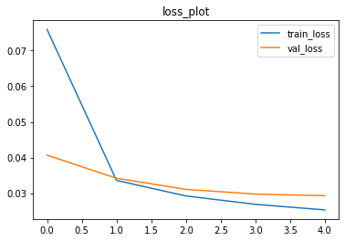
    


## Make a prediction


```python
model = tf.keras.models.load_model('models/baseline_model.h5')
```

    WARNING:tensorflow:No training configuration found in the save file, so the model was *not* compiled. Compile it manually.
    

## Prediction function


```python
def predict(img_paths, stride=32, batch_size=128):
    results = []
    for img_path in img_paths:
        img = cv2.imread(img_path)
        img = img.astype(np.float32)/255
        crop = []
        position = []
        batch_count = 0

        result_img = np.zeros_like(img)
        voting_mask = np.zeros_like(img)

        for top in tqdm(range(0, img.shape[0], stride)):
            for left in range(0, img.shape[1], stride):
                piece = np.zeros([img_size, img_size, 3], np.float32)
                temp = img[top:top+img_size, left:left+img_size, :]
                piece[:temp.shape[0], :temp.shape[1], :] = temp
                crop.append(piece)
                position.append([top, left])
                batch_count += 1
                if batch_count == batch_size:
                    crop = np.array(crop)
                    pred = model(crop)*255
                    crop = []
                    batch_count = 0
                    for num, (t, l) in enumerate(position):
                        piece = pred[num]
                        h, w, c = result_img[t:t+img_size, l:l+img_size, :].shape
                        result_img[t:t+img_size, l:l+img_size, :] += piece[:h, :w]
                        voting_mask[t:t+img_size, l:l+img_size, :] += 1
                    position = []
        
        result_img = result_img/voting_mask
        result_img = result_img.astype(np.uint8)
        results.append(result_img)
        
    return results
```


```python
def rmse_score(true, pred):
    score = math.sqrt(np.mean((true-pred)**2))
    return score

def psnr_score(true, pred, pixel_max):
    score = 20*np.log10(pixel_max/rmse_score(true, pred))
    return score
```

## Validation result


```python
result = predict(val_input_files[:5], 32)
```

    100%|██████████| 77/77 [00:41<00:00,  1.85it/s]
    100%|██████████| 77/77 [00:34<00:00,  2.22it/s]
    100%|██████████| 77/77 [00:35<00:00,  2.16it/s]
    100%|██████████| 77/77 [00:35<00:00,  2.17it/s]
    100%|██████████| 77/77 [00:34<00:00,  2.23it/s]
    


```python
for i, (input_path, label_path) in enumerate(zip(val_input_files[:5], val_label_files[:5])):
    input_img = cv2.imread(input_path)
    input_img = cv2.cvtColor(input_img, cv2.COLOR_BGR2RGB)
    targ_img = cv2.imread(label_path)
    targ_img = cv2.cvtColor(targ_img, cv2.COLOR_BGR2RGB)
    pred_img = result[i]
    pred_img = cv2.cvtColor(pred_img, cv2.COLOR_BGR2RGB)
    
    plt.figure(figsize=(20,10))
    plt.subplot(1,3,1)
    plt.imshow(input_img)
    plt.title('input_img', fontsize=10)
    plt.subplot(1,3,2)
    plt.imshow(pred_img)
    plt.title('output_img', fontsize=10)
    plt.subplot(1,3,3)
    plt.imshow(targ_img)
    plt.title('target_img', fontsize=10)
    plt.show()
    print('input PSNR :', psnr_score(input_img.astype(float), targ_img.astype(float), 255))
    print('output PSNR :', psnr_score(result[i].astype(float), targ_img.astype(float), 255), '\n')
```


    
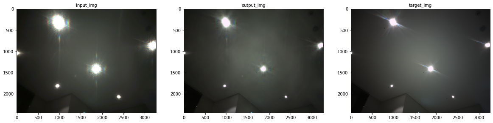
    


    input PSNR : 21.319842770194096
    output PSNR : 28.363052348823132 
    
    


    
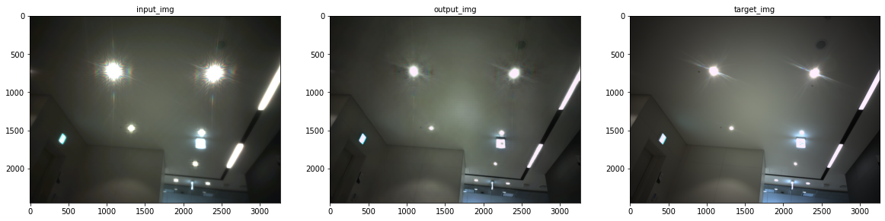
    


    input PSNR : 20.699688771000467
    output PSNR : 26.070890709152692 
    
    


    
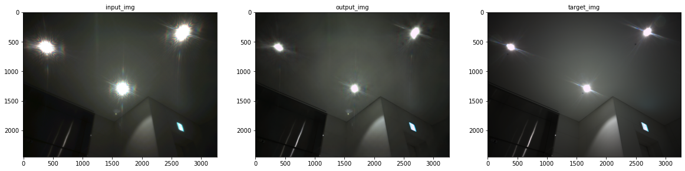
    


    input PSNR : 21.733467472035976
    output PSNR : 29.313979236345837 
    
    


    
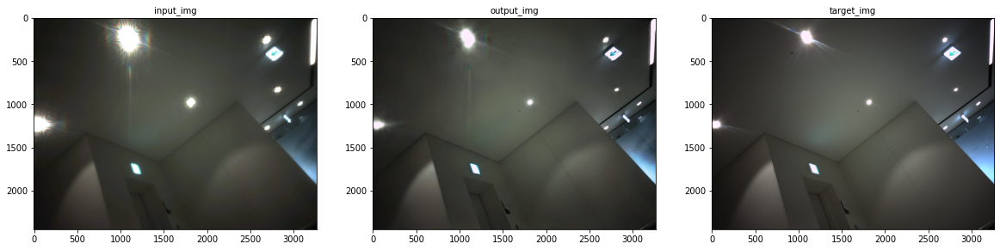
    


    input PSNR : 20.92765411186867
    output PSNR : 25.164551976910182 
    
    


    
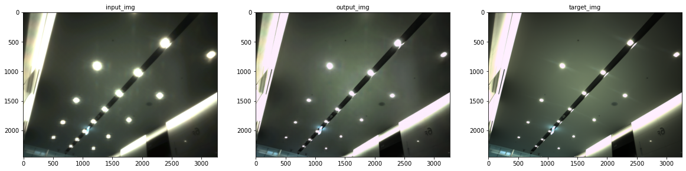
    


    input PSNR : 21.007323217924263
    output PSNR : 26.023537416033243 
    
    

## Testing result


```python
test_input_files = './data/test_input_img/'+test_csv['input_img']
```


```python
test_result = predict(test_input_files, 32)
```

    100%|██████████| 77/77 [00:32<00:00,  2.35it/s]
    100%|██████████| 77/77 [00:31<00:00,  2.42it/s]
    100%|██████████| 77/77 [00:31<00:00,  2.42it/s]
    100%|██████████| 77/77 [00:31<00:00,  2.42it/s]
    100%|██████████| 77/77 [00:31<00:00,  2.43it/s]
    100%|██████████| 77/77 [00:31<00:00,  2.41it/s]
    100%|██████████| 77/77 [00:31<00:00,  2.42it/s]
    100%|██████████| 77/77 [00:31<00:00,  2.42it/s]
    100%|██████████| 77/77 [00:31<00:00,  2.43it/s]
    100%|██████████| 77/77 [00:31<00:00,  2.47it/s]
    100%|██████████| 77/77 [00:31<00:00,  2.41it/s]
    100%|██████████| 77/77 [00:31<00:00,  2.43it/s]
    100%|██████████| 77/77 [00:31<00:00,  2.41it/s]
    100%|██████████| 77/77 [00:31<00:00,  2.43it/s]
    100%|██████████| 77/77 [00:31<00:00,  2.42it/s]
    100%|██████████| 77/77 [00:31<00:00,  2.41it/s]
    100%|██████████| 77/77 [00:31<00:00,  2.41it/s]
    100%|██████████| 77/77 [00:31<00:00,  2.41it/s]
    100%|██████████| 77/77 [00:31<00:00,  2.41it/s]
    100%|██████████| 77/77 [00:31<00:00,  2.43it/s]
    


```python
for i, input_path in enumerate(test_input_files):
    input_img = cv2.imread(input_path)
    input_img = cv2.cvtColor(input_img, cv2.COLOR_BGR2RGB)
    pred_img = test_result[i]
    pred_img = cv2.cvtColor(pred_img, cv2.COLOR_BGR2RGB)
    
    plt.figure(figsize=(20,10))
    plt.subplot(1,2,1)
    plt.imshow(input_img)
    plt.title('input_img', fontsize=10)
    plt.subplot(1,2,2)
    plt.imshow(pred_img)
    plt.title('output_img', fontsize=10)
    plt.show()
```


    
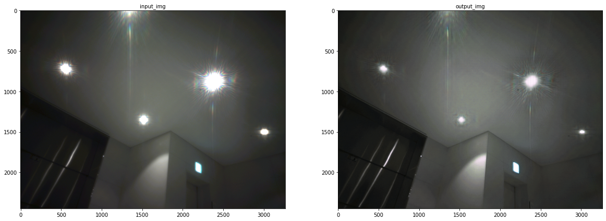
    


    
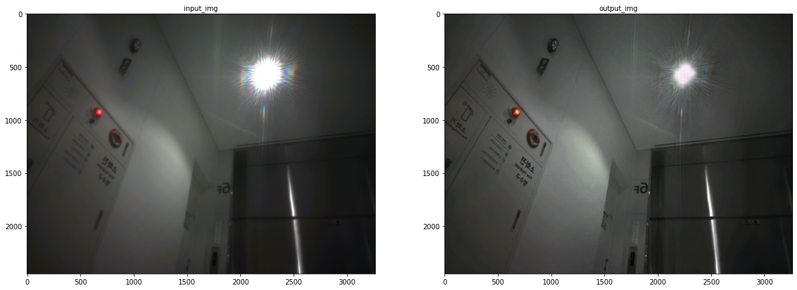
    


    
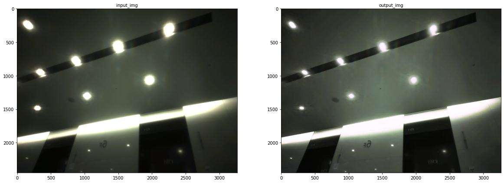
    


    
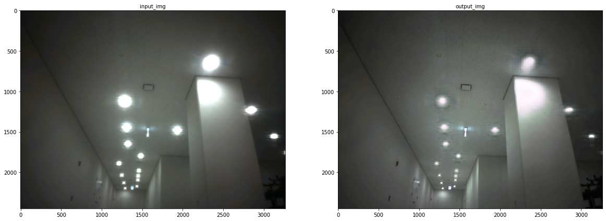
    


    

    


    
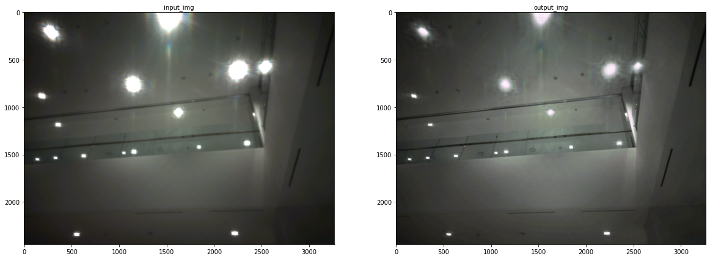
    


    
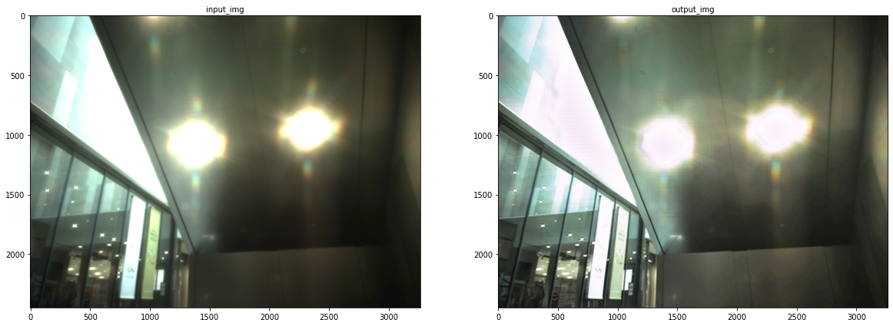
    


    
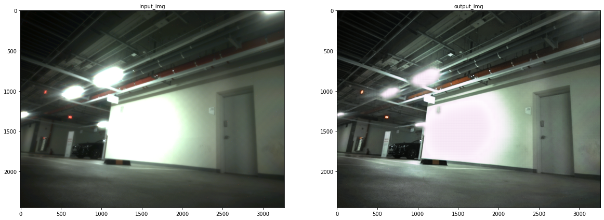
    


    
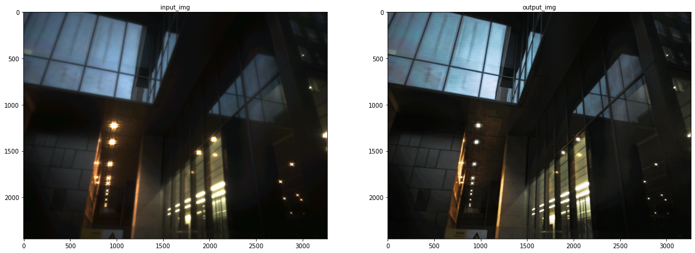
    


    
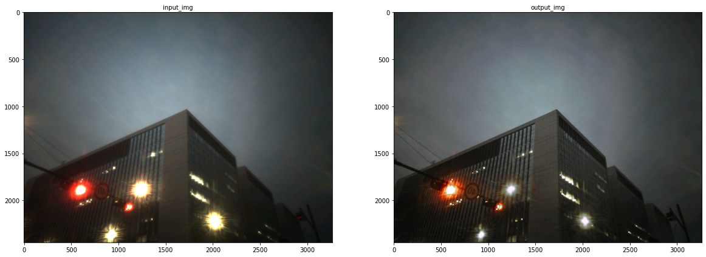
    


    
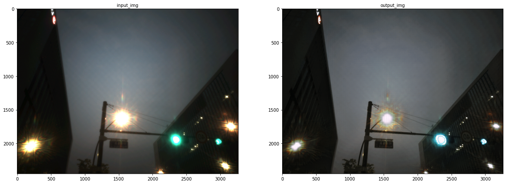
    


    
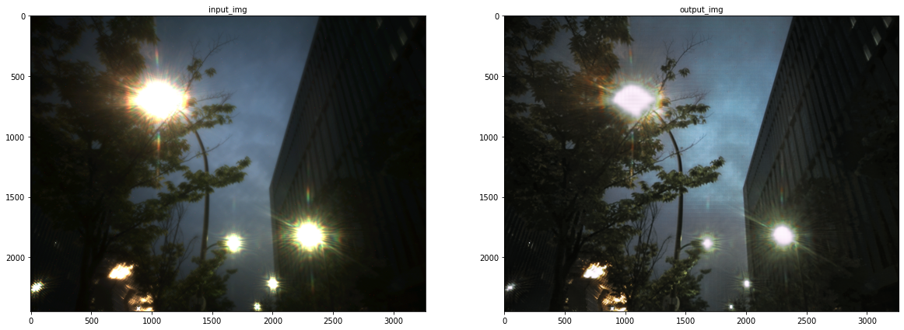
    


    
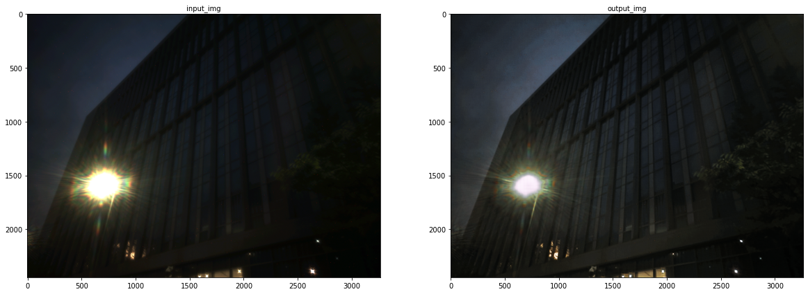
    


    
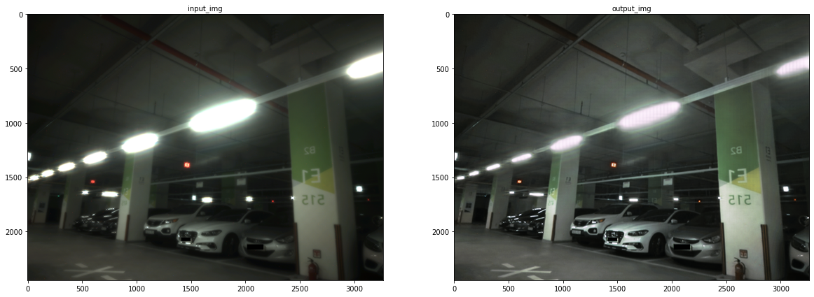
    


    
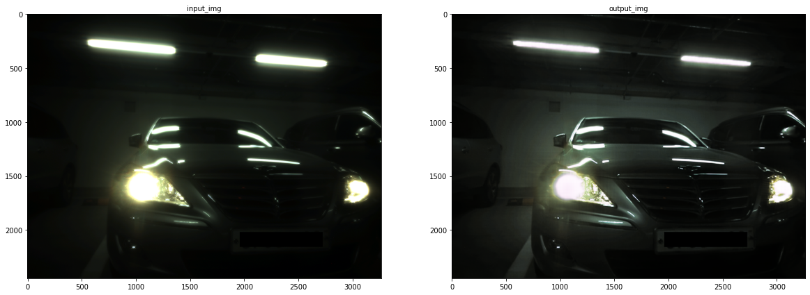
    


    
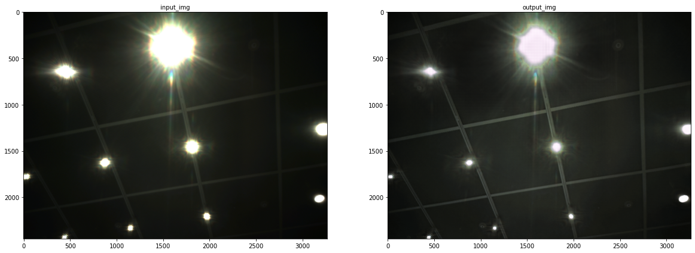
    


    
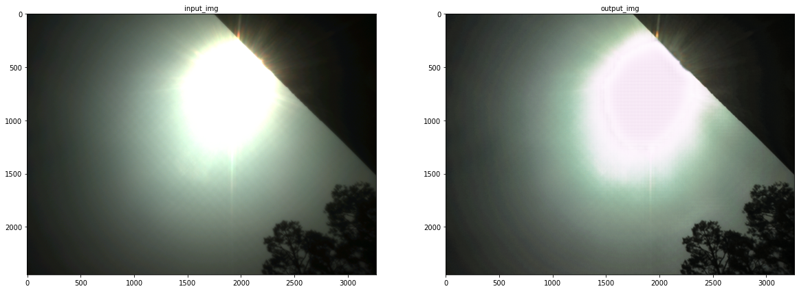
    


    
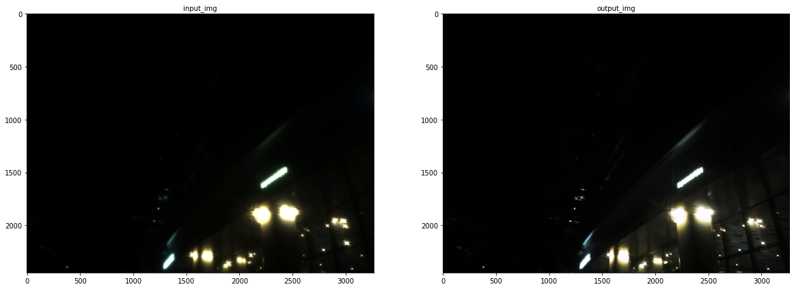
    


    
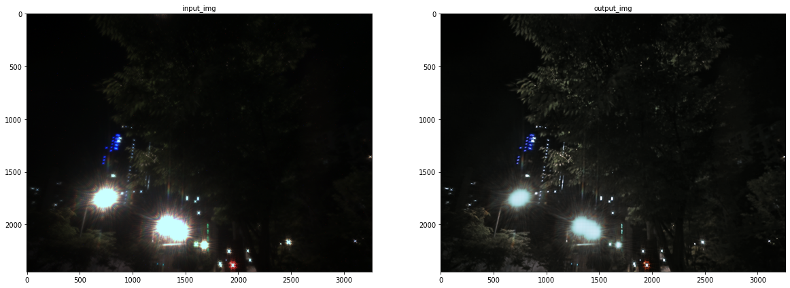
    


    

    


```python

```


```python

```
